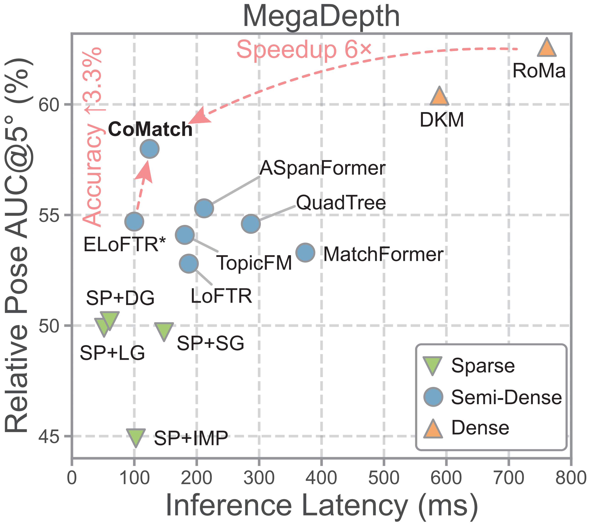
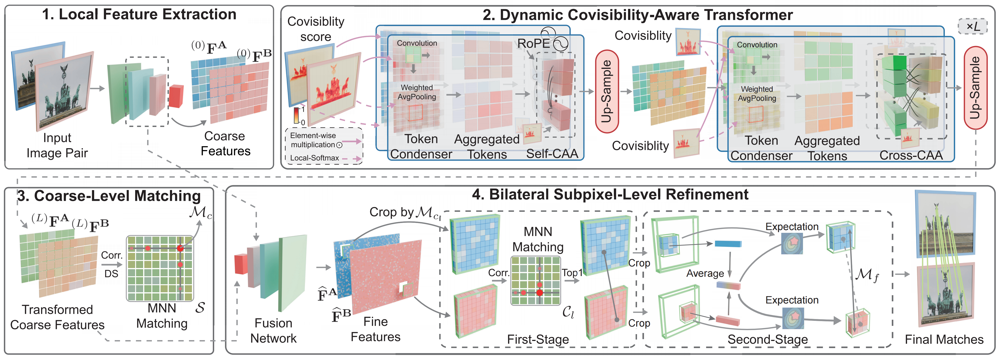
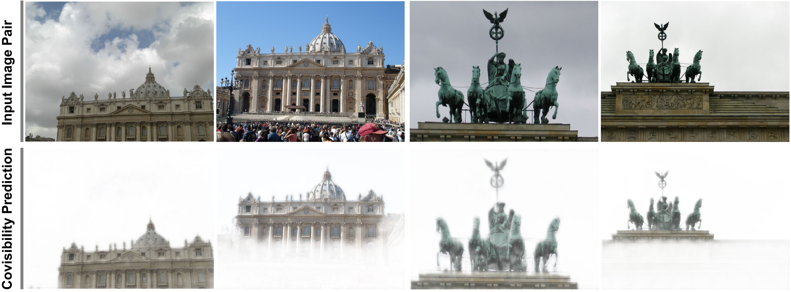

# CoMatch: Dynamic Covisibility-Aware Transformer for Bilateral Subpixel-Level Semi-Dense Image Matching (🏆 ICCV '25 Highlight)

 
[]()
[]()


### [Paper](https://arxiv.org/pdf/2503.23925) 

Welcome to the **CoMatch** repository! This is the official implementation of our ICCV'25 paper titled "CoMatch: Dynamic Covisibility-Aware Transformer for Bilateral Subpixel-Level Semi-Dense Image Matching".

*Accepted to ICCV 2025 Conference*

<div align="center">
  
  <br/>
</div>

## 🧠 Pipeline Overview
- **Stage 1:** Given a pair of images, a CNN network extracts coarse features $^{(0)}\mathbf{F}^{\mathbf{A}}$ and $^{(0)}\mathbf{F}^{\mathbf{B}}$, alongside fine ones.
- **Stage 2:** Dynamic covisibility-aware Transformer is stacked $L$ times to conduct efficient, robust, and compact context interaction for coarse feature transformation.
- **Stage 3:** Transformed coarse features are correlated, followed by a dual-softmax (DS) operation to yield the assignment matrix $\mathcal{S}$, where mutual nearest neighbor (MNN) matching is used to establish coarse matches $\mathcal{M}_c$.
- **Stage 4:** Fine distinctive features $\widehat{\mathbf{F}}^\mathbf{B}$ and $\widehat{\mathbf{F}}^\mathbf{B}$ at the original resolution are derived by progressively fusing $^{(L)}\mathbf{F}^{\mathbf{A}}$ and $^{(L)}\mathbf{F}^{\mathbf{B}}$ with backbone features at $\frac{1}{4}$ and $\frac{1}{2}$ resolutions. Later, feature patches centered on $\mathcal{M}_c$ are cropped, followed by a two-stage refinement to produce fine matches $\mathcal{M}_f$ with bilateral subpixel accuracy.

<div align="center">
  
  <br/>
</div>

## 🧪 Visualization of Covisibility Prediction
We first bilinearly up-sample the covisibility score map to match the original image resolution, and then multiply it with the input image.

<div align="center">
  
  <br/>
</div>

## 🏗️ Training and Inference
## Installation
```shell
conda env create -f environment.yaml
conda activate comatch
pip install torch==2.0.0+cu118 --index-url https://download.pytorch.org/whl/cu118
pip install -r requirements.txt 
```
The test and training can be downloaded by [download link](https://drive.google.com/drive/folders/1DOcOPZb3-5cWxLqn256AhwUVjBPifhuf?usp=sharing) provided by LoFTR

We provide our pre-trained model in [download link](https://drive.google.com/file/d/1DHd7LZtNH1vwhoTUA8a8nVIiIpx-38RX/view?usp=sharing)

## Reproduce the testing results with pytorch-lightning
You need to first set up the testing subsets of ScanNet and MegaDepth. We create symlinks from the previously downloaded datasets to `data/{{dataset}}/test`.

```shell
# set up symlinks
ln -s /path/to/scannet-1500-testset/* /path/to/CoMatch/data/scannet/test
ln -s /path/to/megadepth-1500-testset/* /path/to/CoMatch/data/megadepth/test
```

### Inference
```shell
conda activate comatch
bash scripts/reproduce_test/outdoor.sh # evalutaion on MegaDepth
bash scripts/reproduce_test/indoor.sh # evalutaion on ScanNet
```

## Training
```shell
conda activate comatch
bash scripts/reproduce_train/comatch_outdoor.sh comatch_outdoor
```
## Citation

If you find this code useful for your research, please use the following BibTeX entry.

```bibtex
@inproceedings{li2025comatch,
  title={CoMatch: Dynamic Covisibility-Aware Transformer for Bilateral Subpixel-Level Semi-Dense Image Matching},
  author={Li, Zizhuo and Lu, yifan and Tang, Linfeng and Zhang, Shihua and Ma, Jiayi},
  booktitle={ICCV},
  year={2025}
}
```

## 🙋‍♂️ Acknowledgements

We build upon recent advances in [Efficient LoFTR](https://github.com/zju3dv/EfficientLoFTR/tree/main) and [LoFTR](https://github.com/zju3dv/LoFTR).
