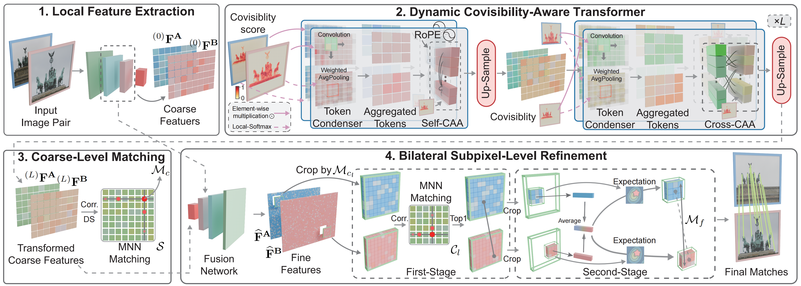

# CoMatch: Dynamic Covisibility-Aware Transformer for Bilateral Subpixel-Level Semi-Dense Image Matching

 

### [Paper](https://arxiv.org/pdf/2503.23925) 

Welcome to the **CoMatch** repository! This is the official implementation of our ICCV'25 paper titled "CoMatch: Dynamic Covisibility-Aware Transformer for Bilateral Subpixel-Level Semi-Dense Image Matching".

*Accepted to ICCV 2025 Conference*

## 🧠 Pipeline Overview
- **Stage 1:** Given a pair of images, a CNN network extracts coarse features $^{(0)}\mathbf{F}^{\mathbf{A}}$ and $^{(0)}\mathbf{F}^{\mathbf{B}}$, alongside fine ones.
- **Stage 2:** Dynamic covisibility-aware Transformer is stacked $L$ times to conduct efficient, robust, and compact context interaction for coarse feature transformation.
- **Stage 3:** Transformed coarse features are correlated, followed by a dual-softmax (DS) operation to yield the assignment matrix $\mathcal{S}$, where mutual nearest neighbor (MNN) matching is used to establish coarse matches $\mathcal{M}_c$.
- **Stage 4:** Fine distinctive features $\widehat{\mathbf{F}}^\mathbf{B}$ and $\widehat{\mathbf{F}}^\mathbf{B}$ at the original resolution are derived by progressively fusing $^{(L)}\mathbf{F}^{\mathbf{A}}$ and $^{(L)}\mathbf{F}^{\mathbf{B}}$ with backbone features at $\frac{1}{4}$ and $\frac{1}{2}$ resolutions. Later, feature patches centered on $\mathcal{M}_c$ are cropped, followed by a two-stage refinement to produce fine matches $\mathcal{M}_f$ with bilateral subpixel accuracy.

  
   

## 🧪 Visualization of Covisibility Prediction
We first bilinearly up-sample the covisibility score map to match the original image resolution, and then multiply it with the input image.

  
   

